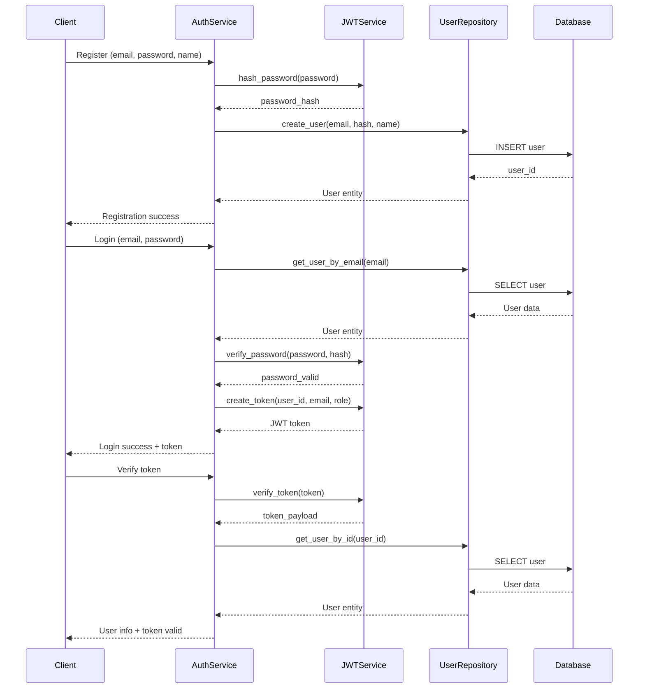

# JWT Service and User Repository Examples

This directory contains simplified, educational examples of JWT authentication and User Repository implementations using Clean Architecture principles.

## 🏗️ Architecture Overview

These examples demonstrate Clean Architecture with clear separation of concerns:

```
┌─────────────────────────────────────────────────────────────┐
│                    Clean Architecture                        │
├─────────────────────────────────────────────────────────────┤
│  Domain Layer (Business Logic)                              │
│  ├── Entities (User)                                        │
│  ├── Value Objects (JWTToken, Email)                       │
│  └── Business Rules & Validation                           │
├─────────────────────────────────────────────────────────────┤
│  Application Layer (Use Cases)                              │
│  ├── AuthenticationService                                  │
│  ├── User Registration                                      │
│  ├── User Login                                             │
│  └── Token Verification                                     │
├─────────────────────────────────────────────────────────────┤
│  Infrastructure Layer (External Services)                   │
│  ├── JWTService (PyJWT + bcrypt)                          │
│  ├── UserRepository (SQLite)                               │
│  └── Database Operations                                    │
└─────────────────────────────────────────────────────────────┘
```

## 📁 File Structure

```
backend/examples/auth/
├── __init__.py                    # Package initialization
├── jwt_service_example.py         # JWT service with PyJWT and bcrypt
├── user_repository_example.py    # User repository with SQLite
├── complete_auth_example.py       # Complete authentication flow
├── test_examples.py              # Comprehensive tests
└── README.md                     # This documentation
```

## 🚀 Quick Start

### Prerequisites

Make sure you have the required dependencies installed:

```bash
pip install PyJWT bcrypt pytest pytest-asyncio
```

### Running Examples

1. **JWT Service Example**:
```bash
cd backend/examples/auth
python jwt_service_example.py
```

2. **User Repository Example**:
```bash
python user_repository_example.py
```

3. **Complete Authentication Example**:
```bash
python complete_auth_example.py
```

4. **Run Tests**:
```bash
python -m pytest test_examples.py -v
```

## 🔧 Components

### 1. JWT Service (`jwt_service_example.py`)

A complete JWT authentication service using PyJWT and bcrypt.

**Features**:
- `create_token(user_id, email, role)` - Generate JWT access tokens
- `verify_token(token)` - Verify and decode tokens
- `hash_password(password)` - Hash passwords with bcrypt
- `verify_password(password, hash)` - Verify password against hash
- Token revocation and blacklisting
- Comprehensive error handling

**Usage**:
```python
from jwt_service_example import create_jwt_service

# Create JWT service
jwt_service = create_jwt_service("your-secret-key")

# Hash password
password_hash = jwt_service.hash_password("MySecurePassword123!")

# Create token
token = jwt_service.create_token(1, "user@example.com", "customer")

# Verify token
payload = jwt_service.verify_token(token)
```

### 2. User Repository (`user_repository_example.py`)

A SQLite-based user repository following Clean Architecture.

**Features**:
- `create_user(email, password_hash, first_name, last_name)` - Create new user
- `get_user_by_email(email)` - Retrieve user by email
- `get_user_by_id(user_id)` - Retrieve user by ID
- `update_user(user_id, updates)` - Update user fields
- `delete_user(user_id)` - Delete user
- `list_users(limit, offset)` - List users with pagination
- `count_users()` - Count total users

**Usage**:
```python
from user_repository_example import create_user_repository

# Create user repository
user_repo = create_user_repository("users.db")

# Create user
user = await user_repo.create_user(
    email="john@example.com",
    password_hash="$2b$12$example_hash",
    first_name="John",
    last_name="Doe"
)

# Get user by email
user = await user_repo.get_user_by_email("john@example.com")
```

### 3. Complete Authentication Service (`complete_auth_example.py`)

A complete authentication system combining JWT service and User Repository.

**Features**:
- User registration with password hashing
- User login with JWT token generation
- Token verification for protected routes
- User profile management
- Complete authentication flow

**Usage**:
```python
from complete_auth_example import create_authentication_service

# Create authentication service
auth_service = create_authentication_service()

# Register user
result = await auth_service.register_user(
    email="user@example.com",
    password="SecurePassword123!",
    first_name="John",
    last_name="Doe"
)

# Login user
login_result = await auth_service.login_user("user@example.com", "SecurePassword123!")

# Verify token
verify_result = await auth_service.verify_token(login_result["token"])
```

## 🧪 Testing

The examples include comprehensive tests covering:

- **JWT Service Tests**:
  - Token creation and verification
  - Password hashing and verification
  - Token expiration and revocation
  - Error handling

- **User Repository Tests**:
  - CRUD operations
  - Duplicate user handling
  - Database operations
  - Error scenarios

- **Authentication Service Tests**:
  - Complete authentication flow
  - Registration and login
  - Token verification
  - Profile management

**Run Tests**:
```bash
# Run all tests
python -m pytest test_examples.py -v

# Run specific test class
python -m pytest test_examples.py::TestJWTService -v

# Run with coverage
python -m pytest test_examples.py --cov=. --cov-report=html
```

## 🏛️ Clean Architecture Principles

### 1. Separation of Concerns
- **Domain Layer**: Business logic and entities
- **Application Layer**: Use cases and orchestration
- **Infrastructure Layer**: External services and data access

### 2. Dependency Inversion
- Services depend on abstractions, not implementations
- Easy to swap implementations (e.g., PostgreSQL instead of SQLite)
- Testable with mock objects

### 3. Single Responsibility
- Each class has one reason to change
- JWT service only handles tokens
- User repository only handles user data

### 4. Open/Closed Principle
- Open for extension, closed for modification
- Easy to add new authentication methods
- Easy to add new user fields

## 🔒 Security Features

### Password Security
- **bcrypt hashing** with 12 rounds (configurable)
- **Salt generation** for each password
- **Password verification** without storing plain text

### JWT Security
- **HS256 algorithm** for token signing
- **Token expiration** (1 hour default)
- **Token revocation** and blacklisting
- **Secure random refresh tokens**

### Database Security
- **SQLite with WAL mode** for better performance
- **Prepared statements** to prevent SQL injection
- **Unique constraints** on email addresses
- **Proper error handling** without information leakage

## 📊 Database Schema

```sql
CREATE TABLE users (
    id INTEGER PRIMARY KEY AUTOINCREMENT,
    email TEXT NOT NULL UNIQUE,
    password_hash TEXT NOT NULL,
    first_name TEXT NOT NULL,
    last_name TEXT NOT NULL,
    created_at TIMESTAMP DEFAULT CURRENT_TIMESTAMP
);

CREATE INDEX idx_users_email ON users(email);
CREATE INDEX idx_users_created_at ON users(created_at);
```

## 🔄 Authentication Flow



## 🚀 Production Considerations

### What's Included (Educational)
- ✅ Basic JWT implementation
- ✅ SQLite database
- ✅ bcrypt password hashing
- ✅ Clean Architecture structure
- ✅ Comprehensive tests

### Production Enhancements Needed
- 🔄 **Database**: Use PostgreSQL/MySQL instead of SQLite
- 🔄 **Caching**: Add Redis for token blacklisting
- 🔄 **Rate Limiting**: Implement login attempt limits
- 🔄 **Email Verification**: Add email verification flow
- 🔄 **Password Reset**: Add password reset functionality
- 🔄 **Logging**: Add comprehensive logging
- 🔄 **Monitoring**: Add metrics and monitoring
- 🔄 **Security Headers**: Add security middleware
- 🔄 **HTTPS**: Ensure all communication is encrypted

## 📚 Learning Resources

### Clean Architecture
- [Clean Architecture by Robert C. Martin](https://blog.cleancoder.com/uncle-bob/2012/08/13/the-clean-architecture.html)
- [Domain-Driven Design](https://martinfowler.com/bliki/DomainDrivenDesign.html)

### JWT Security
- [JWT Best Practices](https://tools.ietf.org/html/rfc8725)
- [JWT Security Cheat Sheet](https://cheatsheetseries.owasp.org/cheatsheets/JSON_Web_Token_for_Java_Cheat_Sheet.html)

### Python Security
- [OWASP Python Security](https://owasp.org/www-project-python-security/)
- [Python Security Best Practices](https://python-security.readthedocs.io/)

## 🤝 Contributing

These examples are designed for educational purposes. For production use:

1. **Review Security**: Ensure all security best practices are followed
2. **Add Tests**: Include comprehensive test coverage
3. **Add Logging**: Implement proper logging and monitoring
4. **Add Documentation**: Document all APIs and configurations
5. **Add CI/CD**: Set up continuous integration and deployment

## 📄 License

This project is part of the Clean Architecture E-commerce course examples.

---

**Note**: These examples are simplified for educational purposes. For production applications, always follow security best practices and conduct thorough security reviews.
